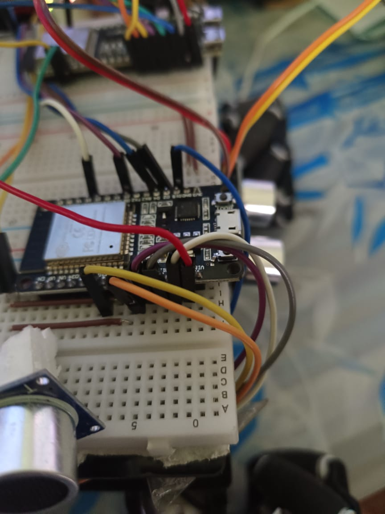

# Myra Rover Logic Controller

<div align="center">
    
    <br>
    <em>Myra Rover - Autonomous Navigation</em>
    <br>
    <br>
</div>

This project implements the logic controller for the Myra Rover, an ESP32-based autonomous rover with multiple control modes. The controller manages movement commands, obstacle avoidance, and different operation modes using ESP-NOW protocol for communication.

## Related Repositories

The Myra Rover project consists of multiple interconnected components that work together to create a complete autonomous rover system:

### [Motor Controller](https://github.com/ShivanshGhelani/Myra-Rover-motor-controller)
- Handles motor driver control and power management
- Interprets movement commands from Logic Controller
- Manages PWM signals for precise motor control
- Implements safety features and emergency stops

### [Ground Controller](https://github.com/ShivanshGhelani/Myra-Rover-ground-controller)
- Provides user interface for manual control
- Displays real-time sensor data and rover status
- Processes voice commands for rover control
- Manages WiFi communication with Logic Controller

### [Main Project Repository](https://github.com/ShivanshGhelani/Myra-Rover)
- Complete system architecture and documentation
- Hardware assembly and wiring guides
- Communication protocol specifications
- Setup and configuration instructions
- Integration guidelines for all components
- Project roadmap and development notes

### System Interaction Flow
```
Ground Controller                Logic Controller (Current)              Motor Controller
     |                                     |                                  |
     |        WiFi Commands                |         ESP-NOW Protocol         |
     | ---------------------------------> | --------------------------------> |
     |                                    |                                   |
     |      Status & Sensor Data          |         Movement Feedback        |
     | <--------------------------------- | <-------------------------------- |
     |                                    |                                   |
```

The Logic Controller (this repository) acts as the central brain of the system, processing commands from the Ground Controller and making intelligent decisions about movement and navigation, which are then executed by the Motor Controller.

Visit the main repository for comprehensive information about the entire project, including:
- System Architecture
- Complete Setup Instructions
- Integration Guide
- Project Documentation
- Hardware Requirements
- Assembly Instructions

## Features

- **Multiple Control Modes:**

  - Manual Control Mode
  - Autonomous Mode with obstacle avoidance
  - Voice Command Mode
- **Ultrasonic Sensor Integration:**

  - Front, Front-Left, and Front-Right sensors for obstacle detection
  - Real-time distance measurement
  - Configurable safety thresholds
- **ESP-NOW Communication:**

  - Low-latency communication between controllers
  - Support for various movement commands
  - Speed control capabilities
- **WiFi Command Interface:**

  - Remote control capability via WiFi
  - Mode switching support
  - Real-time command processing

## Hardware Requirements

- ESP32-S3-DevKitC-1 board
- Ultrasonic sensors (HC-SR04 or compatible)
  - Front sensor
  - Front-Left sensor
  - Front-Right sensor
- Additional ESP32 board for receiving commands (not included in this repository)

## Software Dependencies

- Platform: Espressif32
- Framework: Arduino
- Libraries:
  - ESP-NOW
  - WiFi
  - FreeRTOS

## Project Structure

```
├── include/
│   ├── auto_mode.h          # Autonomous mode declarations
│   ├── esp_now_sender.h     # ESP-NOW communication
│   ├── ultrasonic.h         # Ultrasonic sensor interface
│   ├── voice_command_mode.h # Voice command mode
│   └── wifi_commands.h      # WiFi command processing
├── src/
│   ├── auto_mode.cpp        # Autonomous mode implementation
│   ├── esp_now_sender.cpp   # ESP-NOW communication implementation
│   ├── main.cpp            # Main program entry
│   ├── ultrasonic.cpp      # Ultrasonic sensor implementation
│   ├── voice_command_mode.cpp # Voice command implementation
│   └── wifi_commands.cpp    # WiFi command implementation
├── platformio.ini          # PlatformIO configuration
└── README.md              # This file
```

## Setup and Configuration

1. Install PlatformIO in your development environment
2. Clone this repository
3. Update the `broadcastAddress` in `esp_now_sender.cpp` with your receiver's MAC address
4. Configure WiFi credentials in `esp_now_sender.h` if needed
5. Build and upload to your ESP32-S3 board

## Building and Uploading

```bash
# Build the project
pio run

# Upload to ESP32
pio run --target upload

# Monitor serial output
pio device monitor
```

## Command Protocol

The system uses hexadecimal commands for control:

### Movement Commands

- `0x01`: Move Forward
- `0x02`: Move Backward
- `0x03`: Turn Left
- `0x04`: Turn Right
- `0x05`: Move Forward Left
- `0x06`: Move Forward Right
- `0x07`: Move Backward Left
- `0x08`: Move Backward Right
- `0x09`: Spin Clockwise
- `0x0A`: Spin Counterclockwise
- `0x0B`: Diagonal Left
- `0x0C`: Diagonal Right
- `0x0D`: Diagonal Left Reverse
- `0x0E`: Diagonal Right Reverse
- `0x00`: Stop

### Special Commands

- `0x0F`: Toggle Autonomous/Manual Mode
- `0x16`: Toggle Voice Command Mode

## Safety Features

- Configurable safety distances for obstacle detection
- Emergency stop when obstacles are too close
- Automatic obstacle avoidance in autonomous mode
- Task prioritization using FreeRTOS

## Contributing

1. Fork the repository
2. Create your feature branch (`git checkout -b feature/AmazingFeature`)
3. Commit your changes (`git commit -m 'Add some AmazingFeature'`)
4. Push to the branch (`git push origin feature/AmazingFeature`)
5. Open a Pull Request

## Demo Videos

The following demo videos showcase the Myra Rover in action:

1. [Demo 1](Videos/1.mp4) - Basic Movement and Control
2. [Demo 2](Videos/2.mp4) - Autonomous Mode Demonstration
3. [Demo 3](Videos/3.mp4) - Voice Command Features
4. [Demo 4](Videos/4.mp4) - Obstacle Avoidance System

To play these videos:

1. Clone the repository
2. Navigate to the `Videos` folder
3. Use your preferred media player to view the demonstrations

## License

MIT License

Copyright (c) 2025

Permission is hereby granted, free of charge, to any person obtaining a copy
of this software and associated documentation files (the "Software"), to deal
in the Software without restriction, including without limitation the rights
to use, copy, modify, merge, publish, distribute, sublicense, and/or sell
copies of the Software, and to permit persons to whom the Software is
furnished to do so, subject to the following conditions:

The above copyright notice and this permission notice shall be included in all
copies or substantial portions of the Software.

THE SOFTWARE IS PROVIDED "AS IS", WITHOUT WARRANTY OF ANY KIND, EXPRESS OR
IMPLIED, INCLUDING BUT NOT LIMITED TO THE WARRANTIES OF MERCHANTABILITY,
FITNESS FOR A PARTICULAR PURPOSE AND NONINFRINGEMENT. IN NO EVENT SHALL THE
AUTHORS OR COPYRIGHT HOLDERS BE LIABLE FOR ANY CLAIM, DAMAGES OR OTHER
LIABILITY, WHETHER IN AN ACTION OF CONTRACT, TORT OR OTHERWISE, ARISING FROM,
OUT OF OR IN CONNECTION WITH THE SOFTWARE OR THE USE OR OTHER DEALINGS IN THE
SOFTWARE.

## Acknowledgments

- ESP32 Community
- PlatformIO Team
- FreeRTOS Team
- All contributors who helped in testing and development

---

<div align="center">
    Made with ❤️ by Shivansh Ghelani
    <br>
    <br>
    
    <br>
    <em>Myra Rover - Making Autonomous Navigation Accessible</em>
</div>
